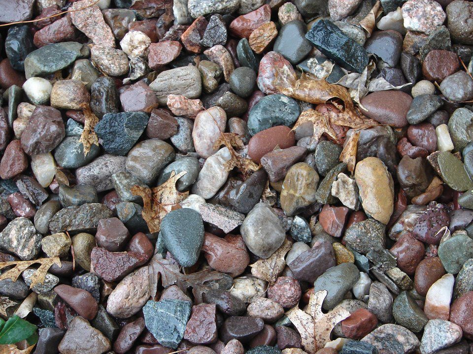
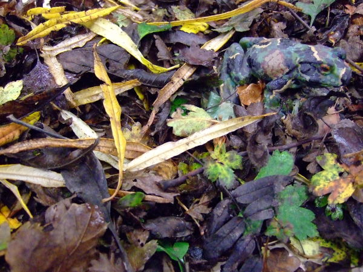

```{r setup, include=FALSE}
knitr::opts_chunk$set(echo = FALSE)
```

## Contenido

> -  Concepto de abundancia

> -  Probabilidad de detección

> -  Metas de trabajo grupal

> -  Metas para la próxima semana

## Abundancia

Cantidad de individuos que están delimitados de alguna forma

  - Geográfica: Delimitación natural de un ecosistema asociado con la especie.
  
  - Genética: Aislamiento repoductivo.
  
  - Artificial: Beaker, Parque Nacional.
  
La abundancia depede de la densidad. Y la densidad depende, entre otras cosas, de la adecuación del hábitat y la salud de la población.
  
## Poblaciones abiertas y cerradas

- La abundancia es una variable dinámica.

- La natalidad, mortalidad, inmigración y emigración la modifican constantemente.

- **Abundancia en una población abierta**: Influyen los cuatro factores anteriores

- **Abundancia en una población cerada**: Solo se toma en cuenta el crecimiento (Natalidad -- Mortalidad)
 
## Abundancia... o conteo
 
- La abundancia es independiente del método utilizado para estimarla.

- Los conteos... no.

- Incluso un indicador de abundancia, es diferente de un conteo.

La diferencia radica, en que el conteo depende de la abundancia y la *probabilidad de detección*.

## Probabilidad de detección


```{r,fig.align='center', out.width=600}

```
## Probabilidad de detección


```{r,fig.align='center', out.width=600}

```

## Probabilidad de detección


```{r,fig.align='center', out.width=600}

```


## Cómo se calcula

El principio es muy sencillo. Cada individuo durante un muestreo tiene dos estados: *detectado*, o *no detectado*. Por tanto, la cantidad de individuos que fueron observados, son una porción del total de individuos. Si tamaño poblacional es igual a $N$, entonces, podemos decir que:

$$
N = \frac{y}{p}
$$

## Si consideramos el conteo como una variable aleatoria...

 $$
 y \sim \text{Binomial}\left( N,p\right)
 $$
 
 Pero surge un problema. Debemos estimar dos parámetros ($N$, y $p$), con un solo dato (conteos).
 
 Para ello se han desarrollado muchos protocoles de muestreo, que aportan información adicional para el análisis de datos:
 

## Muestreo a distancia

- Consiste en hacer un conteo de animales y reportar junto a cada animal observado, la distancia perpendicular al transepto de muestreo.

- Usualmente utilizado para el conteo de animales grandes

- En \textsf{R} existe el paquete [`rdistance`](https://CRAN.R-project.org/package=Rdistance).

## Historial de capturas/recapturas

- Se utiliza en animales marcados.

- Cada animal genera un historial de captura/recaptura, de acuerdo al número de ocasiones de muestreo.

Estos modelos se basan en una extensión de la distribución de probabilidad Binomial, llamada distribución multinomial. 

- [`Rmark`](https://CRAN.R-project.org/package=RMark).

## Muestreo por remoción

- Basado en la proporción de individuos que son capturados de una ocasión de remoción a la siguiente.

- Por ejemplo, si en la primer remoción capturo 100 individuos, en la segunda capturo 50 individuos, y en la tercera capturo 25 indivudos, la probabilidad de captura es $p=0.5$

- El paquete [`unmarked`](https://CRAN.R-project.org/package=unmarked) contiene métodos para muestreo por remoción.

##Doble observador

- Mezcla los modelos de remoción, con los de captura y recaptura.

El muestreo consiste en dos observadores, el principal anota todas sus observaciones, y las dice al observador secundario. Luego, el secundario anota, cualquier otro individuo que no fue visualizado por el observador primario. Con estos datos, se calcula la probabilidad de detección, y se estima la abundancia.

- El paquete [`unmarked`](https://CRAN.R-project.org/package=unmarked) contiene métodos para muestreo por doble observador.

## Práctica! Modelo básico

Simulando los datos...

```{r c4genDatAbunExmML, echo=TRUE}
set.seed(1937)
y <- rbinom(n = 5, size = 100, prob = 0.3)

# n es el número de repeticiones, size = sería el tamaño poblacional
# y prob la probabilidad de captura

y
```

## Modelo básico

Necesitamos conocer la probabilidad de observar esos datos. Dado el valor de un parámetro, para luego maximizar esta función


$$
L(N) = \prod_{i =1}^n\text{Binomial}( y_{i} |N,p)
$$

Sacamos logaritmos y negamos la expresión para que la computación sea más fácil.

$$
nlL(N) = (-1)\times\sum_{i =1}^n \log\left( \text{Binomial}(N|y_i,p)\right)
$$


## Modelo básico

Traducimos a R:

```{r c4logLikN, echo=TRUE, results='hide'}
# Función de 'menos log-verosimilitud'
nlL <- function(p){#p, se refiere a parámetros. 
  N <- floor(p[1]) #floor toma el entero
  valor <- -1*sum( dbinom(y, size = N, prob = 0.3,log = TRUE) )
  
  # A veces trabajar con logaritmos genera valores irreales.
  # Solo queremos valores válidos. El paso de abajo hace esto.
  valor <- valor[which(!is.na(valor) | !is.nan(valor) | valor != -Inf)]
  return(valor)
}
```

## Modelo básico

Optimizamos

```{r c4SalidaLik, echo=TRUE, results='hide'}
salida <-
  optim(
  par = c(mean(y) / 0.3),
  fn = nlL,
  method = "Brent",
  lower = 0,
  upper = 1e6
  )

salida
```

## La verosimilitud es proporcional a una distribución de probabilidad

Si no existe información previa...

```{r c4PlotLik, echo=FALSE, fig.align='center', fig.cap='La verosimilitud es proporcional a una distribución de probabilidad', fig.pos='htb!', fig.width=5, message=FALSE, warning=FALSE}
plot(80:140, sapply(
  X = 80:140,
  FUN = function(X) {
  return(exp(-1 * nlL(X)))
  }
  ),
  ylab = "Verosimilitud",
  xlab = "Espacio del parámetro N",
  axes = FALSE,
  type = "h", lwd = 2)
abline(v = salida$par, lwd = 3, col = "red")
axis(side=1)
```

## Tarea 05 

...? Era para hoy...


## Metas para entregar hoy

Procedimiento de campo.

Base de datos, en blanco... Excel

**Pendientes de la semana tras-anterior**

- Procedimiento de análisis

## Gira próxima semana

- Salida de la UNA Mier. 16, 6:30 am

- Llevar manga larga, protección solar, gorra, gafas.

- Watershoes

- ó... Zapato cerrado, y ajustado, suela dura. Se van a mojar. Sandalias sueltas no se permiten.

- Al menos, 4 litros de agua por persona.

## Más 

- Llevar comida, para cocinar allá.

- Ropa de cama, mosquitero, repelente.

- Bolsas para ropa húmeda.

- Libreta de campo. Preferiblemente resistente al agua.

- Salir desayunados... llegamos a tabajar.

**No llevar**

- Computadora, objetos valiosos.

**Regresamos jueves a las 14:00**. Clases con Meyer


# Avances del trabajo grupal